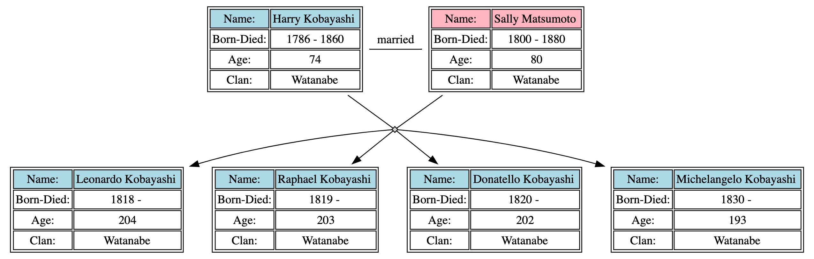
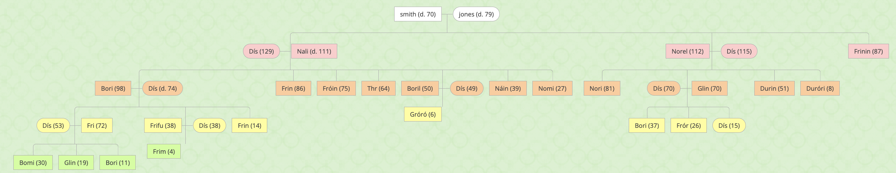
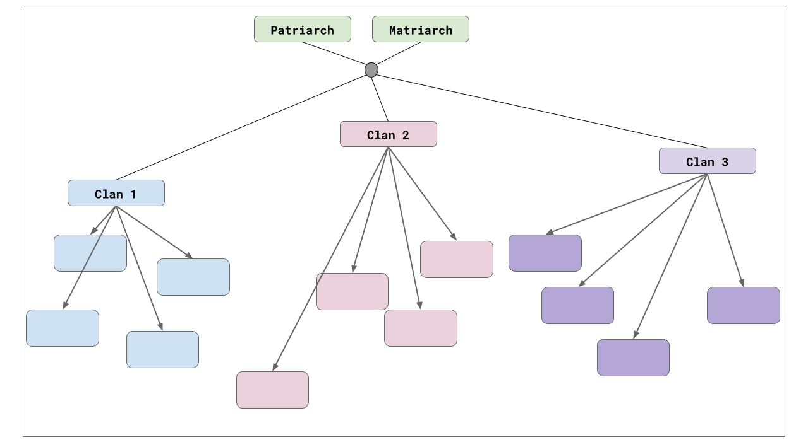

## Assignment 5 - FamilyTree via Graphviz

#### Due: 06-14-2023 (Wednesday @ 10:10 a.m.)

### Overview

This project turned bigger than expected. So, I have a few paths that I will allow you to take, based on what your interests are. Ultimately, I need you to produce a family tree graph generated using GraphViz and also done **programmatically**, meaning, you do not create the graph by hand, you use a programming language and (optionally) a library to generate the `dot` file for the graph. I will be providing some files for you to optionally use, but I would rather you do one of the following:

1. use a tool like the following: http://mcdemarco.net/tools/family-tree-generator/lineage.html to generate your own unique family tree
2. or use your own code to randomly generate a family tree. I don't recommend this, as you may get caught up investing a lot of time generating your own data.

Having said that, if you use a family tree file from option 1, I want you to replace all the names and clan names, with random names from some of the files I have provided you. See next section for more information about those files.

There will need to be minimum of lets say 7-10 generations included in your family tree. Look at the image below to get an idea of what information I would like you to show for a parent and their children.



### Files

I have a number of files with names, since names are hard to randomly generate. I have two different formats: `csv` and `txt`. The table below has links and lists the fields if it is a `csv`, where the `txt` files have a single value per row.

|  #  | Name                                                   | Type | Fields                         |
| :-: | :----------------------------------------------------- | :--: | :----------------------------- |
|  1  | [asian_first_names.csv](./names/asian_first_names.csv) | csv  | id,first name,gender           |
|  2  | [asian_surnames.csv](./names/asian_surnames.txt)       | txt  | none                           |
|  3  | [clan_names.csv](./names/clan_names.txt)               | txt  | none                           |
|  4  | [asian_first_names.csv](./names/dnd_first_names.csv)   | csv  | name, gender                   |
|  5  | [dnd_last_names.csv](./names/dnd_last_names.txt)       | txt  | none                           |
|  6  | [mock_names.csv](./names/mock_names.csv)               | csv  | id,first_name,last_name,gender |

In addition there are two files provided that have family tree data. The `dwarf_family_tree` file has a correctly connected family graph, but the `mockaroo_family_tree` has a better structure (in my thoughts), so I'm including them both as examples.

|  #  | Name                                                       | Type | Fields                                                                                                                      |
| :-: | :--------------------------------------------------------- | :--: | :-------------------------------------------------------------------------------------------------------------------------- |
|  1  | [dwarf_family_tree.csv](./dwarf_family_tree.csv)           | csv  | `pid, name, gender, generation, byear, dyear, dage, myear, mage, ptype, clan, spouseId, parentId1, parentId2, parentNodeId` |
|  2  | [mockaroo_family_tree_2.csv](./mockaroo_family_tree_2.csv) | csv  | `id,first_name,last_name,gender,birthdate,deathdate,mother_id,father_id,spouse_id,children_ids`                             |

### The Family Tree



I imagine that most of you will use something generated from the [site](http://mcdemarco.net/tools/family-tree-generator/lineage.html) we discussed in class. This may be necessary as I want your family tree to include "clans" as part of each family. Each clan should get a unique color at the least. What I would like to see, is a sub-graph with the oldest patriarch and matriarch of each clan as the root of that respective sub-graph, and anyone else in that clan, would be branched down from those individuals. See abstract view below:



Here is a stack overflow article that might be some help with generating the dot code: https://stackoverflow.com/questions/2271704/family-tree-layout-with-dot-graphviz

### Summary

- Use existing family tree data provided by me or generated by a place of your choosing.
- Ensure that the names in the family tree data are realistic, and not like the dwarf names in the example file. This is why I provided so many name files, so you can replace unrealistic names with realistic ones.
- Ensure that every person, is part of a clan. A married person will change clans based on either the patriarch or the matriarch, that is up to you, just be consistent.
- Attempt to organize your family tree by clans.
- Use a programming language to auto generate your family tree, based on the input file that you create. I should be able to provide a file with 10 or 1000 rows, and your tree should still be created.
- I envision that most of you will generate a `dot` file with python, then paste that dot file into one of the online editors we have used to create the image.

### Deliverables

- Create a folder called `A05` to place your assignment files in.
- You should have the following files:
  `family_tree.dot`
  - the code file that generated or edited the family tree data
  - the code file to create the `dot` file for your tree
  - the output image from your `dot` code and name it `family_tree.png` (or jpg or svg or whatever image format its in).
  - a file called `family_tree_data.csv` (or `json`) that contains the family tree data you are using to make the tree.
- Look [HERE](../../Resources/01-Readmees/README.md) for information on creating good README's for your projects.

### You can use html to format nodes as well

This is a little snippet to show that if any of you have used html, you can use tables to format nodes as well if you like.

```
  digraph G {
    "Record" [ label=<<table>
                          <tr>
                              <td>A</td>
                              <td bgcolor='#00CC11'>B</td>
                          </tr>
                       </table>
                      >
             ];
  }
```
